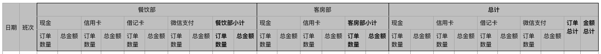

# Woda
## 背景说明
从Solr 5.1 开始, Povit 和 Stat两组件可以协同工作了. 这意味着我们可以利用Solr实现复杂的数据透视表所需要的分组统计功能. 

基于这一功能特性, 我们可以实现大范围数据的统计, 和动态分析报表. Woda(Wobase Data Analysis和简称)就是基于这一项新的基础功能而实现的.

## Woda可以做什么
* 任意级数的行分组或者列分组
* 可以定义的列名称
* 提供每一级分组的小计功能
* 自动生成多级的动态表头, 并自动合并父级单元格
* 自动去除没有任何统计数据的列
* 处理10万行左右的Solr查询结果(JSON格式), 生成为最终的HTML, 在60ms左右可以完成

## 预备知识
要使用Woda, 开发人员需要先掌握Solr的以下特性:

1. 基本查询(`q`), 以及结果行数控制(`start`, `rows`)
2. 切片(`facet`), 透视(`facet.pivot`)和统计关联(`{stats}`)
3. 统计(`stats`), 以及如何定义统计标签(`{tag}`)

> https://www.apache.org/dyn/closer.lua/lucene/solr/ref-guide/ 提供了PDF格式的参考手册. 请自动下载学习.
> 
> https://cwiki.apache.org/confluence/display/solr/Faceting#Faceting-CombiningStatsComponentWithPivots 提供了如何结合stats和facet pivot两个组件工作的说明和示例.
> 
> Woda基于PECL Solr 2.0开发, API文档位于http://php.net/manual/en/book.solr.php, 如果对细节实现有兴趣, 请先掌握该扩展模块的使用.

## 示例设计

假设需要如下的透视表:
1. 使用`天(Day)` 和 `班次(Schedule)`(例如: 早班, 晚班)进行行分组
2. 使用 `子部门(SubDept)` 和 `付款类型(PayType)`进行两级的列分组
3. 统计`订单数量 - count(Order)` 和 `订单金额 - sum(Amount)`

预期形成如下的报表头部

## 开发步骤

Step 1. 生成Solr查询, 代码如下:

~~~php
<?php
$query = new SolrQuery();

$query
->setQuery("*:*")
->setStart(0)
->setRows(0)
->setFacet(true)
->setStats(true)
->addStatsField("{!tag=order}Amount")
->addParam("facet.pivot", "{!stats=order}Day,Schedule,SubDept,PayType");
?>
~~~

Step 2. 取出查询结果的facet部分生成透视表

~~~php
<?php
// 具体的Solr服务器配置, 请自行设置
$client = new SolrClient($config);
$pivotData = $client->query($query)->getResponse()->facet_counts;
?>
~~~

Step 3. 设置透视表

~~~php
<?php

$report = new SolrPovitReport();

$report
// 添加分组设置
->addGroupField(
   PovitFieldSetting::instance()
   ->setType(PovitFieldSetting::TYPE_ROW) // 行分组字段
   ->setField('Day')
   ->setLabel('日期')
   ->setSort(1)) // 添加日期例设置
->addGroupField(
   PovitFieldSetting::instance()
   ->setType(PovitFieldSetting::TYPE_ROW)
   ->setField('Schedule')
   ->setLabel('班次')
   ->setSort(2)) // 添加班次例设置
->addGroupField(
   PovitFieldSetting::instance()
   ->setType(PovitFieldSetting::TYPE_COL) // 列分组字段
   ->setField('SubDept')
   ->setHasSubtotal(true) // 添加分组小计子列
   ->setIngoreZero(true) // 自动去除空值列
   ->setSort(3)) // 子部门将成为多级列分组的最上一级分组
->addGroupField(
   PovitFieldSetting::instance()
   ->setType(PovitFieldSetting::TYPE_COL) // 列分组
   ->setField('PayType')
   ->setHasSubtotal(true) // 添加分组小计子列
   ->setIngoreZero(true) // 自动去除空值列
   ->setSort(4)) // 支付类型将成为多级列分组的第二级分组
// 添加统计设置
->addStatField(PovitFieldSetting::instance()
   ->setType(PovitFieldSetting::TYPE_STAT) // 统计字段
   ->setField('Amount') // 使用Amount统计结果
   ->setFun(PovitFieldSetting::FUN_COUNT) // Count记录数
   ->setLabel('订单数量')) // 订单数量统计列
->addStatField(PovitFieldSetting::instance()
   ->setType(PovitFieldSetting::TYPE_STAT) // 统计字段
   ->setField('Amount') // 使用Amount统计结果
   ->setFun(PovitFieldSetting::FUN_SUM) // Sum 记录值
   ->setLabel('总金额')); // 订单总金额统计列
?>
~~~

Step 4. 生成动态表头和报表

~~~php
<?php
//构造一个虚拟的树根节点, 用于挂载表树头结构
$header = HeaderTreeNode::instance()->setField('reportHeadRoot');

$pivotKey = implode(',', array_keys($report->groupFields));

// 组织表头数据 
$report->orgReport($facet_count->facet_pivot->$pivotKey, $header);

// 生成表头
$header->toHtmlHeaderData($header, 0, 0, true);

// 输出表头
echo $header->generateHtmlTHead();

// 输出报表
foreach($report->data as $row){
    echo "<tr>\n";
    foreach($bind as $field){
        echo "<td>";
        if(array_key_exists($field, $row)){
            echo $row[$field];
        }else{
            echo " ";
        }
        echo "</td>\n";
    }
    echo "</tr>\n";
}
?>
~~~

~~ end ~~